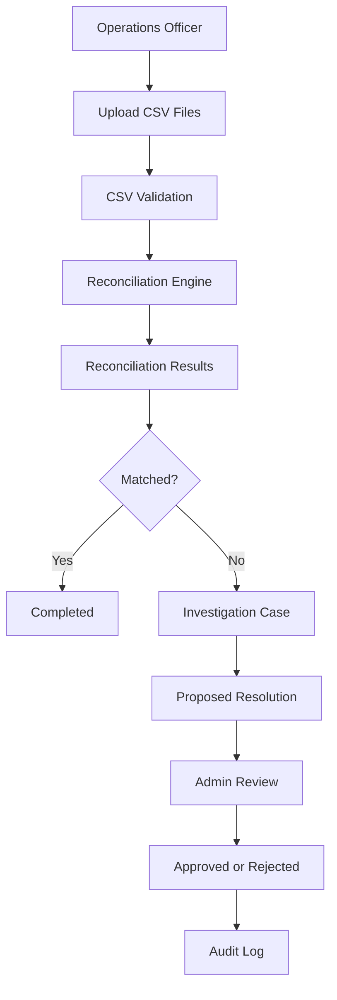

# PayRecon

PayRecon is a backend payment reconciliation system built with Java and Spring Boot. It compares a company’s internal transaction records with records received from a payment provider and identifies missing, duplicated, or inconsistent transactions.

The project demonstrates how fintech operations teams investigate payment discrepancies using a secure maker-checker workflow.

## Problem Being Solved

Businesses that receive payments through external payment providers maintain their own internal transaction records. The payment provider also maintains a separate record of those transactions.

These records may disagree because of:

* Different transaction amounts
* Different payment statuses
* Missing provider transactions
* Missing internal transactions
* Duplicate transactions
* Delayed settlement or processing

PayRecon automatically compares both records and produces reconciliation results for the operations team.

## Users and Roles

### Operations Officer

The Operations Officer can:

* Upload internal and provider CSV files
* Run reconciliation
* View reconciliation results
* View matched transactions
* Investigate unresolved cases
* Submit proposed resolutions

### Admin

The Admin can:

* View reconciliation information
* Review proposed resolutions
* Approve resolutions
* Reject resolutions
* View system audit logs

## Maker-Checker Workflow

PayRecon separates investigation and approval responsibilities.

1. The Operations Officer uploads both transaction files.
2. The system validates the CSV records.
3. The reconciliation engine compares transactions by reference.
4. Matched and unresolved transactions are classified.
5. The Operations Officer investigates unresolved cases.
6. The Operations Officer submits a proposed resolution.
7. The Admin approves or rejects the resolution.
8. Important activities are recorded in the audit log.

This prevents the person proposing a resolution from making the final decision on the same case.

## Reconciliation Classifications

| Status                  | Meaning                                                | Requires Investigation |
| ----------------------- | ------------------------------------------------------ | ---------------------: |
| `MATCHED`               | Internal and provider records agree                    |                     No |
| `AMOUNT_MISMATCH`       | Transaction amounts are different                      |                    Yes |
| `STATUS_MISMATCH`       | Transaction statuses are different                     |                    Yes |
| `MISSING_FROM_PROVIDER` | Internal record exists, but provider record is missing |                    Yes |
| `MISSING_INTERNALLY`    | Provider record exists, but internal record is missing |                    Yes |
| `DUPLICATE`             | A transaction reference appears more than once         |                    Yes |

## Investigation States

```text
OPEN
  ↓
UNDER_REVIEW
  ↓
PENDING_APPROVAL
  ├── APPROVED
  └── REJECTED
```

## Architecture



## Technology Stack

* Java
* Spring Boot 4
* Spring Data JPA
* Spring Security
* PostgreSQL
* Docker and Docker Compose
* Maven
* JUnit
* Mockito
* Springdoc OpenAPI
* Swagger UI
* Lombok

## Main Features

* Multipart CSV upload
* CSV validation
* Internal and provider transaction comparison
* Duplicate transaction detection
* Reconciliation summary and match-rate calculation
* Automatic investigation-case creation
* Maker-checker resolution workflow
* Database-backed authentication
* BCrypt password hashing
* Role-based endpoint authorization
* Audit trail
* Pagination, filtering and sorting
* Consistent API error responses
* Swagger/OpenAPI documentation
* Unit tests for reconciliation and investigation rules

## CSV Format

Both files must use this header:

```csv
reference,amount,status,transactionDate
```

Example internal file:

```csv
reference,amount,status,transactionDate
TXN001,5000.00,SUCCESS,2026-09-18
TXN002,2000.00,SUCCESS,2026-09-18
TXN003,3000.00,SUCCESS,2026-09-18
```

Example provider file:

```csv
reference,amount,status,transactionDate
TXN001,5000.00,SUCCESS,2026-09-18
TXN002,2500.00,SUCCESS,2026-09-18
TXN003,3000.00,FAILED,2026-09-18
```

## Validation Rules

A transaction is rejected when:

* The reference is empty
* The amount is zero or negative
* The status is not recognized
* The transaction date is empty or invalid
* The CSV header is incorrect

Supported transaction statuses:

* `SUCCESS`
* `FAILED`
* `PENDING`

## API Endpoints

### Reconciliation

| Method | Endpoint                                 | Role                        | Description                            |
| ------ | ---------------------------------------- | --------------------------- | -------------------------------------- |
| `POST` | `/api/reconciliations/upload`            | Operations Officer          | Upload internal and provider CSV files |
| `POST` | `/api/reconciliations/{batchId}/run`     | Operations Officer          | Run reconciliation                     |
| `GET`  | `/api/reconciliations/{batchId}/summary` | Admin or Operations Officer | View batch summary                     |

### Investigation Cases

| Method  | Endpoint                                    | Role                        | Description                  |
| ------- | ------------------------------------------- | --------------------------- | ---------------------------- |
| `GET`   | `/api/investigation-cases`                  | Admin or Operations Officer | List and filter cases        |
| `PATCH` | `/api/investigation-cases/{caseId}/start`   | Operations Officer          | Start an investigation       |
| `PATCH` | `/api/investigation-cases/{caseId}/submit`  | Operations Officer          | Submit a proposed resolution |
| `PATCH` | `/api/investigation-cases/{caseId}/approve` | Admin                       | Approve a resolution         |
| `PATCH` | `/api/investigation-cases/{caseId}/reject`  | Admin                       | Reject a resolution          |

### Audit Logs

| Method | Endpoint          | Role  | Description                          |
| ------ | ----------------- | ----- | ------------------------------------ |
| `GET`  | `/api/audit-logs` | Admin | View, filter and paginate audit logs |

## Pagination and Filtering

Investigation cases can be filtered by status:

```text
GET /api/investigation-cases?status=OPEN&page=0&size=20
```

Audit logs can be filtered by action:

```text
GET /api/audit-logs?action=RESOLUTION_APPROVED&page=0&size=20
```

The maximum supported page size is `100`.

## API Documentation

After starting the application, open Swagger UI:

```text
http://localhost:8080/swagger-ui/index.html
```

OpenAPI JSON is available at:

```text
http://localhost:8080/v3/api-docs
```

Use the Swagger **Authorize** button to provide Basic Auth credentials.

## Development Accounts

These accounts are provided only for local development.

### Operations Officer

```text
Username: operations.officer
Password: Officer@123
```

### Admin

```text
Username: admin.user
Password: Admin@123
```

Production credentials should be supplied securely through environment variables or a secret-management system.

## Running the Project

### Requirements

Install:

* Java 17 or later
* Maven
* Docker Desktop
* Git

### Clone the repository

```bash
git clone https://github.com/Olamideeh/payment-reconciliation-.git
cd payment-reconciliation-
```

### Start PostgreSQL and Adminer

```bash
docker compose up -d
```

Services:

| Service      | Address                                       |
| ------------ | --------------------------------------------- |
| PayRecon API | `http://localhost:8080`                       |
| PostgreSQL   | `localhost:5434`                              |
| Adminer      | `http://localhost:8083`                       |
| Swagger UI   | `http://localhost:8080/swagger-ui/index.html` |

### Run the application

On Windows:

```powershell
mvnw.cmd spring-boot:run
```

Or with Maven installed:

```powershell
mvn spring-boot:run
```

## Running Tests

Run every automated test:

```bash
mvn test
```

The test suite covers:

* Matched transactions
* Amount mismatches
* Status mismatches
* Missing transactions
* Duplicate transactions
* Starting an investigation
* Invalid investigation state transitions
* Submitting resolutions
* Admin approval
* Maker-checker protection
* Missing investigation cases
* Audit-event creation

## Error Responses

PayRecon returns structured errors.

Example:

```json
{
  "timestamp": "2026-09-23T12:00:00",
  "status": 404,
  "error": "Not Found",
  "message": "Investigation case not found: 999",
  "path": "/api/investigation-cases/999/start"
}
```

Common status codes:

| Status | Meaning                                          |
| -----: | ------------------------------------------------ |
|  `400` | Invalid request data                             |
|  `401` | Authentication is required                       |
|  `403` | The authenticated user lacks permission          |
|  `404` | Requested resource does not exist                |
|  `409` | Action conflicts with the current workflow state |

## Current Limitations

* Reconciliation currently runs after CSV files are uploaded.
* CSV parsing supports a fixed column format.
* Authentication currently uses HTTP Basic Auth.
* Development users are seeded locally.
* The project does not initiate or process payments.
* The project reconciles transaction records after payment processing.

## Future Improvements

* JWT authentication and refresh tokens
* Scheduled reconciliation jobs
* Real-time provider webhook reconciliation
* Configurable column mapping
* CSV error-report downloads
* Email notifications for pending approvals
* Dashboard frontend
* Metrics and reconciliation alerts
* Cloud deployment
* Database migrations with Flyway

## Author

**Qosim Faruq Olamide**

Backend Java Developer

GitHub: [Olamideeh](https://github.com/Olamideeh)
